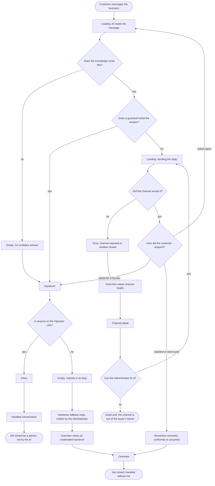
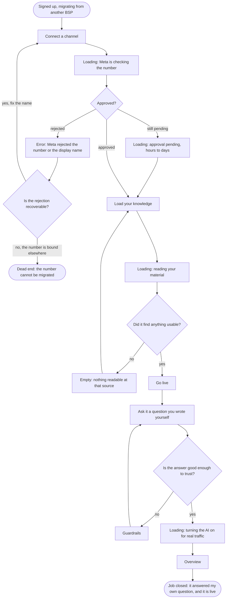
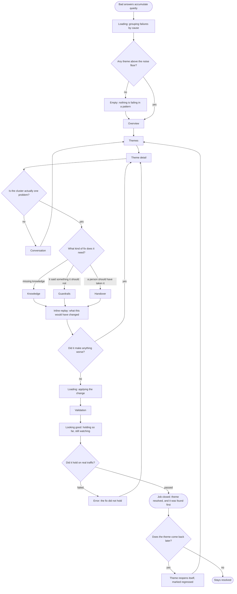
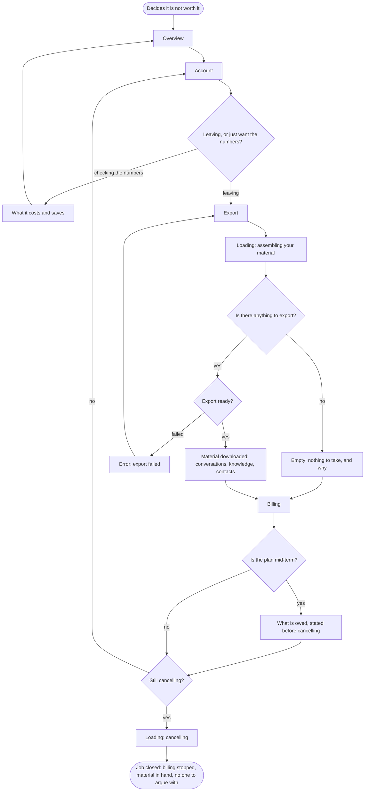

<!-- filled by /dsf:ia — started from .design/templates/flows.md, structure unchanged -->

# Flows

**The main-job flow, complete, plus 2 to 3 key related-job flows** from `jtbd.md`. One
`flowchart TD` per flow, each under a heading naming its job.

Four flows: the main job, plus the three **MVP-core** jobs fixed at the `users.4` gate — R1, R2
and R5. Screen nodes are named exactly as in `ia/sitemap.md`.

---

## Flow 1 — Main job: repeat questions handled without me

*When the same questions keep arriving on WhatsApp and I am the one answering them, I want them
handled without me, so that I can spend my day on the work only I can do.*

**Decisions in words**

| Decision | Yes branch | No branch |
|---|---|---|
| Does the knowledge cover this? | Check the guardrails next | Empty state, hand to a person |
| Does a guardrail forbid the answer? | Hand to a person rather than answer badly | Send the reply |
| Did the channel accept it? | Wait for the customer | Channel error → **`Overview` raises channel health** (D2) |
| Can the Administrator fix the channel? | Back to sending | Out of the buyer's hands — number suspended or bound elsewhere. The one remaining dead end |
| Is anyone on the Operator role? | The exception surface does its job | **Fallback reply fires and `Overview` raises an unattended handover** (D1). No longer a dead end |

**States in words**

| State | What triggers it | The way out |
|---|---|---|
| Loading — AI reads / sending | Every inbound message, and every outbound reply | Resolves to an answer, a handover or a channel error |
| Empty — no confident answer | The knowledge does not cover the question | Handover; the gap becomes a **Failure theme**, which is where Flow 3 starts |
| Empty — nobody on duty | Handover fires with no Operator available | **Fixed at `ia.6` (D1):** the fallback reply the Administrator wrote fires, and `Overview` raises an unattended handover. P1 is a 2–10 person business, so this is the normal configuration, not the edge case |
| Error — channel rejected | Number suspended, template unapproved, or the 24-hour window closed | **Fixed at `ia.6` (D2):** `Overview` raises channel health first, then `Channel detail`. Recoverable failures return to sending; unrecoverable ones are the dead end |

**Endings:** success — two, the AI closes it or a person does · dead end — **one, after the `ia.6`
fixes**: the channel is out of the buyer's hands (suspended, or bound to another BSP). The
"nobody on duty" dead end was removed, not by pretending it cannot happen, but by giving it a
fallback reply and a signal on `Overview`.

---

## Flow 2 — R1: live within the hour (MVP core)

*When I am setting this up for the first time, I want to see it answering my own real questions
within the hour, so that I know I have not bought another thing that does not work.*

**Decisions in words**

| Decision | Yes branch | No branch |
|---|---|---|
| Approved? | Straight to knowledge | Rejected → is it recoverable? · Pending → **setup continues regardless** |
| Is the rejection recoverable? | Fix the display name and retry | The number is bound to another BSP — a real dead end mid-migration |
| Did it find anything usable? | Go live | Empty state at the source, retry |
| Is the answer good enough to trust? | Turn it on | Adjust guardrails and ask again — the loop that makes going live a decision rather than a leap |

**States in words**

| State | What triggers it | The way out |
|---|---|---|
| Loading — Meta checking | Number and display-name verification | Approved, rejected, or the pending state below |
| Loading — approval pending | Display name 3–4 hours, templates 24–48 hours (`research.md` R2) | **Setup continues in parallel, unconditionally.** Fixed at `ia.6` (D3): the branch where it could not was the competitor's behaviour drawn as if it were ours, and it contradicted the brief's own 10-minute criterion |
| Empty — nothing readable | The knowledge source is unreachable, empty or unparseable | Back to `Load your knowledge` with a different source |
| Error — Meta rejected | Name violates policy, or the number is already bound | Back to `Connect a channel` |

**Endings:** success — the AI answers a question the buyer wrote, then goes live · dead end — the
number **cannot be migrated at all** because it is bound elsewhere. That replaced the earlier
"waiting on Meta with nothing to do", which was the category's failure (`research.md` R2:
*"1-2 business days minimum"* behind a *"10-minute API approval"* claim) drawn as if it were
this product's.

---

## Flow 3 — R2: find out before the customer tells me (MVP core)

*When a customer gets a bad answer, I want to find out before they tell me, so that I am not
learning about my own business from a complaint.*

**Decisions in words**

| Decision | Yes branch | No branch |
|---|---|---|
| Any theme above the noise floor? | Surface it on `Overview` | Empty state — the honest "nothing is wrong in a pattern" |
| Is the cluster actually one problem? | Fix it as one | Open a `Conversation` as evidence, then back — **the guard against the pattern's own failure mode**, a bad cluster destroying trust in every cluster |
| What kind of fix does it need? | Three routes: knowledge, guardrails, handover | — |
| Did it make anything worse? | Back to the theme, do not apply | Apply |
| Did it hold on real traffic? | Resolved | Error — the fix did not hold, back to the theme |
| Does the theme come back? | **Reopens itself, marked regressed** — nobody has to notice | Stays resolved |

**States in words**

| State | What triggers it | The way out |
|---|---|---|
| Loading — grouping by cause | Continuously, as conversations land | A theme list, or the empty state |
| Empty — nothing failing in a pattern | Genuinely no cluster above the floor | `Overview`; this state must read as reassurance, not as breakage |
| Inline replay | Any proposed change, before it applies | Seconds, in place — **never its own destination** (`research.md` Pass 2 Q1: a <30-minute setup budget) |
| Looking good — holding so far | Validation running, nothing failing yet | **Added at `ia.6` (M1).** Benchmark mechanic 2 named the sequence; without the intermediate state a validation is a coin flip with a delay |
| Error — the fix did not hold | Validation ran on real traffic and failed | Back to `Theme detail` with what still fails |

**Endings:** success — the theme is resolved, validated on real traffic, and watched for
regression · dead end — none by design; every branch returns to `Theme detail` or `Themes`. The
regression branch is deliberately a **loop, not an ending**: benchmark mechanic 3.

---

## Flow 4 — R5: leave without a fight (MVP core)

*When it stops being worth it, I want to leave without a fight, so that I am not trapped paying
for something I have stopped using.*

**Decisions in words**

| Decision | Yes branch | No branch |
|---|---|---|
| Leaving, or just want the numbers? | `Export` | `What it costs and saves`, then back — the same branch serves R3 |
| Export ready? | Material in hand | Error, retry — **export precedes cancellation deliberately**, so nobody loses their material by cancelling first |
| Is the plan mid-term? | State what is owed **before** the cancel decision | Straight to confirm |
| Still cancelling? | Cancel | Back to `Account`, nothing hidden and nothing punished |

**States in words**

| State | What triggers it | The way out |
|---|---|---|
| Loading — assembling material | Export requested | Download, the empty state, or the error below |
| Empty — nothing to take | New or already-emptied account | **Added at `ia.6` (M2).** Says why there is nothing and continues to `Billing`; a blank download is the worst possible last impression on the way out |
| Error — export failed | Bundle could not be built | Retry from `Export`. **No path forward that cancels without the material** |
| Owed — what is due mid-term | Cancelling before the term ends | Shown *before* the confirm, never after |

**Endings:** success — billing stops, material in hand · **dead end — none, deliberately.** This
is the one flow where the absence of a dead end *is* the design: `research.md` R3 records
*"support becomes unresponsive once you request cancellation"*, *"dark patterns that make it hard
to find the actual cancellation form"* and *"they continue to charge me every month"*. Every
branch here ends either in cancellation or in a voluntary return to `Account`.

---

## Coverage

Every flow traces back to a job in `jtbd.md`, and every node exists in `ia/sitemap.md`.

| Flow | Job | Screen nodes | States present | Both endings? |
|---|---|---|---|---|
| 1 — handled without me | Main | Handover, Channel detail, Inbox, Handled conversation, Overview | empty ×2 · error · loading ×2 | yes — 2 successes, 1 dead end |
| 2 — live within the hour | R1 | Connect a channel, Load your knowledge, Go live, Guardrails, Overview | empty · error · loading ×3 | yes — 1 success, 1 dead end (unmigratable number) |
| 3 — find out first | R2 | Overview, Themes, Theme detail, Conversation, Knowledge, Guardrails, Handover, Validation, ‹inline Replay› | empty · error · loading ×2 | success + regression loop; **no dead end, by design** |
| 4 — leave without a fight | R5 | Overview, Account, What it costs and saves, Export, Billing | **empty** · error · loading ×2 | success only; **the absence of a dead end is the design** |

**Nodes added to `ia/sitemap.md` while drawing these flows:**

- None. Every node above was already in the tree confirmed at the `ia.2` gate.

**Jobs with no flow of their own:** R3, R4, E1, E2, S1, S2. R3 and R4 appear as branches inside
flows 4 and 3 respectively; E1, E2, S1 and S2 are dispositions rather than paths and are traced in
the matrix instead. The command asks for the main job plus 2–3 related; four flows are drawn
because the MVP core has three members and leaving one undrawn would hide it.
